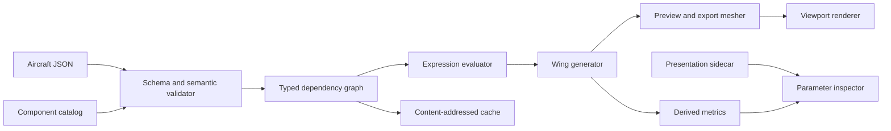

# System Architecture

## Recommended implementation shape

Use a local-first desktop application with a typed compute core and a reactive front end.

| Layer | Recommended responsibility | Suggested technology |
| --- | --- | --- |
| Desktop shell | Files, windows, local permissions, application updates | Tauri 2 |
| UI | Notebook, parameter inspector, viewport controls, diagnostics | React and TypeScript |
| Compute core | Validation, dimensional expressions, dependency graph, geometry, mesh generation | Rust |
| Renderer | Interactive viewport and mesh picking | WebGPU through wgpu or Three.js/WebGPU |
| Persistence | Source JSON, sidecars, derived cache | Local filesystem |

The technology choices are replaceable; the boundaries are not. The UI must never own the geometry truth, and the compute core must not depend on UI state.

## Components



## Core contracts

### Document store

The document store holds the parsed aircraft definition as an immutable snapshot. An edit produces a new snapshot; undo/redo stores inverse patches or prior snapshots. The source is serializable without accessing the renderer or derived cache.

### Semantic validator

JSON Schema checks shape. The semantic validator checks constraints that need meaning: component identifiers, parameter references, dimension compatibility, expression cycles, station ordering, profile validity, and root placement on local XZ.

### Dependency graph

Every literal-backed property, parameter reference, expression, generated profile, station transform, geometry product, metric, and mesh is a typed node. Directed edges point from a dependency to its consumer. Recompute begins only from affected descendants of a committed edit.

### Geometry service

The geometry service accepts an evaluated wing definition and yields a watertight surface model, a mesh at a requested quality, sample curves, and metrics. It returns structured diagnostics rather than throwing UI-facing errors.

### Rendering service

The renderer consumes immutable mesh buffers plus lightweight selection metadata. It never evaluates expressions or changes source values. A selected mesh face maps back to its station or generated feature for source tracing.

## Update transaction

1. The user changes a parameter in the inspector.
2. The UI sends a typed patch with an edit transaction identifier.
3. The core parses the candidate scalar using the document unit system.
4. The core constructs affected graph descendants and validates the new subgraph.
5. If invalid, it preserves the prior committed model and returns an inline diagnostic.
6. If valid, it commits one immutable snapshot, cancels obsolete compute work, and schedules preview recomputation.
7. The renderer receives the newest completed preview only if its transaction identifier still matches the latest committed snapshot.
8. The derived panel updates with the same snapshot identifier.

This transaction boundary prevents a slow mesh from replacing a newer edit and makes undo deterministic.

## Quality tiers and cancellation

Use at least two mesh qualities:

- **Interactive:** low tessellation and debounced recomputation while a slider is dragged.
- **Settled/export:** high-quality adaptive tessellation after the edit settles or when export is requested.

Every compute job receives a cancellation token and source hash. Results with stale hashes are discarded. Mesh and metric caches are content-addressed by the evaluated geometry inputs, quality settings, and generator version.

## Public service API

The UI and future automation layer should call a small stable API:

```text
openDocument(path) -> DocumentSummary
validate(document) -> Diagnostic[]
applyPatch(documentId, patch, transactionId) -> UpdateResult
evaluate(documentId, nodeIds?) -> EvaluationResult
mesh(documentId, quality) -> MeshArtifact
export(documentId, format, options) -> ExportArtifact
traceSelection(documentId, meshElementId) -> SourceTrace
```

`UpdateResult` includes either a new snapshot revision and affected nodes or diagnostics tied to JSON paths and parameter IDs. It must never return partially committed source state.

## Extension seams for buried propulsion

Future components implement the same interface: typed inputs, named outputs, interfaces, validation, evaluation, mesh contribution, and derived data. A duct can therefore bind an inlet lip location to `@station.kink.position`, while a propulsion envelope can publish clearance and packaging interfaces to neighboring components. No phase-3 component should need direct access to a wing's internal mesh.
